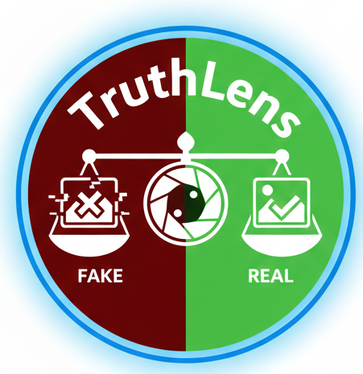

# 🔍 TruthLens - AI-Powered Image Authenticity Detector

<p align="center">
  
</p>

<p align="center">
  
  
  
  
  
</p>

<p align="center">
  <a href="https://imageclasifier-26nylzyg6d3qjjdoaspu49.streamlit.app/"></a>
  <a href="https://github.com/Bhanucreator/ImageClasifier"></a>
</p>

---

**TruthLens** is a deep learning-powered web application that detects fake or AI-generated images using Convolutional Neural Networks (CNN) and Gabor filter texture analysis.

## 🌐 Live Demo

### 🚀 **[Try TruthLens Now → imageclasifier.streamlit.app](https://imageclasifier-26nylzyg6d3qjjdoaspu49.streamlit.app/)**

<p align="center">
  <i>Free • No Sign-up Required • Works on Any Device</i>
</p>

---

## ✨ Features

| Feature | Description |
|---------|-------------|
| 🧠 **Deep Learning** | CNN-based classification for accurate detection |
| 🔬 **Gabor Filters** | Advanced texture analysis for better accuracy |
| ⚡ **Fast Results** | Get predictions in under 1 second |
| 📊 **Confidence Score** | Detailed probability breakdown with visualizations |
| 🎨 **Modern UI** | Beautiful dark theme with glassmorphism design |
| 📱 **Responsive** | Works seamlessly on desktop and mobile |

## 📁 Project Structure

```
📦 ImageClasification
├── 📓 1_Process_Image.ipynb      # Data preprocessing with Gabor filters
├── 📓 CNN_FakeRealClasification.ipynb  # Model training notebook
├── 📓 InferenceFile.ipynb        # Testing and inference
├── 🐍 app.py                     # Streamlit web application
├── 🐍 utils.py                   # Utility functions
├── 📋 requirements.txt           # Python dependencies
├── 📁 Data/                      # Raw dataset (Fake/Real images)
├── 📁 dataset/                   # Processed data (data.npz)
├── 📁 model/                     # Saved model weights
├── 📁 processed/                 # Gabor filtered images
└── 📁 user_input/                # Images for testing
```

## 🛠️ Installation

### Prerequisites
- Python 3.8+
- pip

### Setup

```bash
# Clone the repository
git clone https://github.com/Bhanucreator/ImageClasifier.git
cd ImageClasifier

# Install dependencies
pip install -r requirements.txt

# Run the Streamlit app
streamlit run app.py
```

## 📖 How It Works

### 1. Preprocessing Pipeline
- Raw images are processed using **Gabor filters** for texture extraction
- Images are resized to **128x128** pixels
- Pixel values are normalized (0-1)

### 2. Model Architecture
```
Input (128x128x3)
    ↓
Conv2D(70) + MaxPooling + BatchNorm
    ↓
Conv2D(20) + MaxPooling + BatchNorm
    ↓
Conv2D(10) + MaxPooling + BatchNorm
    ↓
Dropout(0.6)
    ↓
Flatten → Dense(512) → Dropout(0.3)
    ↓
Output: Dense(2) - Fake/Real
```

### 3. Training Notebooks

1. **Process the Data:** Run `1_Process_Image.ipynb` to preprocess images
2. **Train the Model:** Run `CNN_FakeRealClasification.ipynb` to train the CNN
3. **Test:** Run `InferenceFile.ipynb` or use the web app

## 🎯 Usage

### Web Application
1. Upload an image (JPG, PNG, WEBP)
2. Click "Analyze Image"
3. View results with confidence score

### Jupyter Notebooks
```python
# Load model and predict
from tensorflow.keras.models import load_model
model = load_model("model/cnn_model_weights.h5")
```

## 📊 Model Performance

| Metric | Value |
|--------|-------|
| Architecture | CNN (3 Conv layers) |
| Input Size | 128 × 128 × 3 |
| Optimizer | Adam (lr=0.0001) |
| Loss | Binary Crossentropy |

## 🤝 Contributing

Contributions are welcome! Please feel free to submit a Pull Request.

## 📄 License

This project is licensed under the MIT License.

## 👨‍💻 Author

<p align="center">
  
</p>

**Bhanu Kiran**

| Platform | Link |
|----------|------|
| 🐙 GitHub | [@Bhanucreator](https://github.com/Bhanucreator) |
| 📧 Email | bhanukiran90216@gmail.com |
| 🌐 Project | [ImageClasifier](https://github.com/Bhanucreator/ImageClasifier) |

---

## ⭐ Support

If you found this project helpful, please consider giving it a ⭐ on GitHub!

<p align="center">
  <a href="https://github.com/Bhanucreator/ImageClasifier/stargazers">
    
  </a>
</p>

---

<p align="center">
  
  
  
</p>

<p align="center">
  <b>🔍 TruthLens</b> — Detecting fake images with the power of AI
</p>
